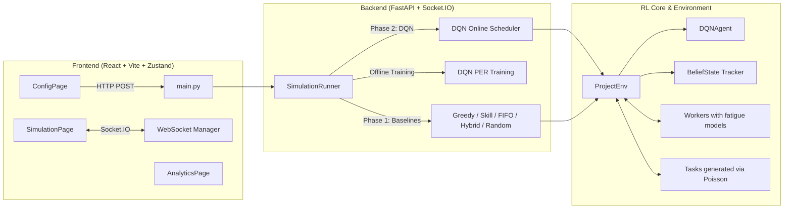

# AMD SlingShot — DQN Workforce Scheduler

## Project Overview

**AMD SlingShot** is a Reinforcement Learning-driven Workforce Scheduling Simulation. It models a complex task assignment scenario where a project manager (an AI agent) must allocate incoming tasks to a heterogenous workforce. The simulation operates in two phases:
1. **Phase 1 (Baselines):** 5 standard scheduling heuristic policies (Greedy, Skill, FIFO, Hybrid, Random) are benchmarked sequentially. While they run, a Dueling Double Deep Q-Network (DQN) agent passively observes the environment and fills its Prioritized Experience Replay (PER) buffer.
2. **Phase 2 (DQN Scheduling):** After an offline training phase, the intelligent DQN agent comes online, dynamically schedules incoming tasks, learning from advanced reward components (e.g., fatigue tracking, skill matching, deadline urgency, idle delays).

A responsive real-time dashboard is provided via React/Vite in the frontend, exchanging state payloads with a scalable FastAPI + Socket.IO server.

---

## Architecture & Data Flow

The architecture decouples the RL environment from the web interface. 

### High-Level Components



### Execution Flow
1. **User Configuration**: User sets `sim_days`, `task_count`, `num_workers`, etc., in the UI.
2. **Initialization**: Frontend posts payload `SimConfig` to `/api/initialize`.
3. **Simulation Runner Pipeline (`simulation_runner.py`)**:
    - Instantiates `ProjectEnv` for each baseline.
    - Emits metrics and Gantt blocks synchronously.
    - Triggers DQN offline training (Phase 2a).
    - Starts the DQN scheduler for the full simulation horizon (Phase 2b).
4. **Environment (`project_env.py`)**: Models 16-slot workdays (8 hours), handling task arrival (Poisson), tracking worker fatigue, executing actions, computing step rewards, and formulating state tensors.

---

## Directory Structure & Modules

```
AMD-SlingShot-Hackathon/
├── backend/
│   ├── main.py              # FastAPI application, socket.io endpoints, SimConfig schema
│   └── simulation_runner.py # Core orchestrator for Phase 1 and 2 execution loops
├── config.py                # Global hyperparameters & constant definitions (DQN, Env)
├── slingshot/
│   ├── agents/
│   │   └── dqn_agent.py     # Dueling Double DQN architecture + PER implementation
│   ├── environment/
│   │   ├── project_env.py   # Gym-like RL Environment, state compiler, reward logic
│   │   ├── worker.py        # Worker stats (fatigue, skill, recovery, burnout)
│   │   ├── task.py          # Task logic, deadline windows, Poisson task generation
│   │   └── belief_state.py  # Bayesian inference engine tracking worker skills
│   ├── baselines/           # Standard baseline heuristics
│   │   ├── greedy_baseline.py
│   │   ├── fifo_baseline.py
│   │   ├── skill_baseline.py
│   │   ├── hybrid_baseline.py
│   │   └── random_baseline.py
│   ├── core/
│   │   └── settings.py      # Pydantic Settings overlay for config.py params
├── frontend/
│   ├── src/
│   │   ├── pages/           # ConfigPage, SimulationPage, AnalyticsPage
│   │   ├── components/      # GanttChart, metrics widgets, Worker states
│   │   ├── store/           # Zustand state management (simulationStore)
│   │   └── types/           # TypeScript payload declarations (config.ts)
├── tests/                   # Smoke tests verifying system and reward integrity
└── README.md                # Comprehensive project documentation
```

### Module Descriptions
- **ProjectEnv (`slingshot/environment/project_env.py`)**: The central heartbeat. Manages clock (ticks & days), computes the 96-dimensional state vector, resolves actions (assignment vs. deferral), computes the heavily shaped reward (priority $\times$ quality$^{2.5}$), and advances time.
- **DQNAgent (`slingshot/agents/dqn_agent.py`)**: Implements Double Dueling DQN logic. Houses `select_action` ($\epsilon$-greedy), `store_transition`, and the PyTorch optimization loop featuring gradient clipping and target-net sync. Prioritized Experience Replay prioritizes unexpected temporal-difference (TD) errors.
- **Task & Worker (`task.py`, `worker.py`)**: Physical entities. Tasks arrive via a genuine Poisson distribution with dynamically calculated caps to eliminate horizon starvation. Workers carry intrinsic heterogeneity (speed multipliers, fatigue sensitivity, hidden skills).

---

## Setup & Installation

### Requirements
- **Python:** 3.10+
- **Node.js:** 18+
- **npm:** 9+

### Windows Instructions
```powershell
# 1. Clone repository
git clone <repo-url>
cd AMD-SlingShot-Hackathon

# 2. Setup Python environment
python -m venv .venv
.\.venv\Scripts\Activate.ps1
pip install -r requirements.txt

# 3. Setup Node environment
cd frontend
npm install
cd ..
```

### macOS/Linux Instructions
```bash
# 1. Clone repository
git clone <repo-url>
cd AMD-SlingShot-Hackathon

# 2. Setup Python environment
python3 -m venv .venv
source .venv/bin/activate
pip install -r requirements.txt

# 3. Setup Node environment
cd frontend
npm install
cd ..
```

---

## Running the Application

To run the full stack, you need two terminals.

**Terminal 1: Backend Server**
```powershell
# Windows
.\.venv\Scripts\Activate.ps1
# Mac/Linux
source .venv/bin/activate

uvicorn backend.main:app --host 0.0.0.0 --port 8000 --reload
```

**Terminal 2: Frontend Server**
```bash
cd frontend
npm run dev
```

**Access the UI** at `http://localhost:5173`.
The backend API and websocket serve at `http://localhost:8000`.

---

## Configuration & Tunable Parameters

The simulation behavior relies on Python variables from `config.py` and User parameters from `main.py/SimConfig` (which overwrite `config.py` at runtime).

### User UI Configuration (`SimConfig`)
- `sim_days` (default 100): Unified simulation timeframe for all phases.
- `phase1_fraction` (default 0.6): Percentage of sim_days used for offline baseline observation.
- `task_count` (default 600): The peak amount of tasks capable of being generated (dynamically determined as `max(user_count, sim_days * rate * 1.5)`).
- `tasks_per_day` (default 4.0): Poisson arrival rate $\lambda$.
- `num_workers` (default 5): Fleet size.
- `max_worker_load` (default 5): Hardware limit block; agents cannot assign more tasks to a worker at this load.
- `worker_mode`: Supports random (auto) or explicit injection.

### DQN / RL Hyperparameters (`config.py`)
- **State/Action**: `STATE_DIM = 96`, `ACTION_DIM = 140` (Allows up to 20 tasks $\times$ 5 workers + deferral).
- **Learning**: `LEARNING_RATE = 2e-4`, `GAMMA = 0.95` (shorter discount emphasizes short horizon scheduling).
- **Replay Buffer**: `REPLAY_BUFFER_MAX_CAPACITY = 8000`, `MIN_REPLAY_SIZE = 32`.
- **Epsilon Decay**: Decays per-decision during Phase 2. Floor set to `EPSILON_END = 0.05`. A training taper reduces 4 gradient descent steps to 2 once epsilon floor is hit to avoid overfitting on greedy policies.
- **PER Parameters**: `PER_ALPHA = 0.6`, `PER_BETA_START = 0.4`.

### Reward Shaping (`project_env.py` / `settings.py`)
- `REWARD_COMPLETION_BASE` (0.8): Scalar for task completion. Heavily compounded by `(task_quality) ^ 2.5` to aggressively penalize poor-skill matching.
- `skill_utilization_rate` Tracker: A rolling 50-decision window. If the agent makes $>40\%$ low quality assignments ($q<0.35$), a $1.5\times$ reward multiplier is forced onto the subsequent 20 decisions to repair local optima divergence.
- Penalties: Hard bounds on idle waiting (-0.05), lateness (-0.1), and extreme mismatched pairings (-0.1).

---

## Theory & RL Details

SlingShot formulates scheduling as a Markov Decision Process (MDP):

### 1. State Representation ($S_t$)
A fixed 96-dimensional tensor:
- **Workers**: Availability, load, fatigue metric, belief skill mean/variance.
- **Tasks**: Priority, complexity, urgency, dependencies, time since arrival. Supports a horizon window of $K=20$ top tasks.
- **Environment Context**: Normalized time, global completion rate, overload tracking, and explicit pairwise **Skill Match Scores** comparing the highest urgency task to all workers simultaneously to reduce combinatorial complexity.

### 2. Action Space ($A_t$)
Discrete mapping resolving to:
- Assign Task $T_i$ to Worker $W_j$.
- Defer Task $T_i$ to next slot.

### 3. Engine Mechanics
The agent relies on **Dueling Double Deep Q-Networks (DDQN)**.
- **Double DQN**: Mitigates Q-value overestimation by using the Online network to pick best actions $a^* = \arg\max_a Q(s, a; \theta)$ and the Target network to evaluate $Q(s', a^*; \theta^-)$.
- **Dueling Architecture**: Splits the fully connected layers into a Value stream $V(s)$ estimating state inherent worth, and Advantage stream $A(s, a)$ determining relative action utility.
- **Prioritized Experience Replay (PER)**: Instead of drawing replay batches uniformly, states with massive prediction errors (high TD-Error) are sampled frequently, drastically scaling the velocity of Phase 2 knowledge acquisition.

---

## Usage Examples

1. **Quick Smoke Test**: Navigate to the UI (`localhost:5173`), leave inputs default (100 days, 60% observation, 5 Workers), and hit **Initialize Simulation**.
2. **Observe Dashboards**: Watch Phase 1 baselines build the backlog. A progress bar transitions to offline DQN PER optimization. Watch the DQN in Phase 2 handle assignments dynamically via the real-time React Gantt chart.
3. **Compare in Analytics**: The final table will compare Throughput/Day, Completion Make-span, and Overload events across Greedy, Skill, Hybrid, and DQN.

---

## Limitations, Assumptions, & Design Decisions

### Assumptions/Decisions
- **Slot Time**: Discretized environment to 30-minute intervals (`SLOT_HOURS = 0.5`).
- **Poisson Arrivals**: Real operations don't guarantee exact quotas; mathematical variance in inter-arrival generation implies that a 100-day 4-task/day generation will not yield exactly 400 tasks. Buffer headrooms (2x Poisson bounds) are in place.
- **Action Masking**: Overloaded workers (`load >= max_worker_load`) are hard-masked off the Action Tensor to prevent recursive overload penalization traps in DQN.
- **Adaptive Quality Tracks**: Early DQN iterations collapsed to high throughput but ignored skills. The custom `skill_utilization_rate` tracker patches this by actively detecting metric slippage and multiplying skill-rewards until bounded.

### Limitations
- The simulation does not support dynamic expansion of the task window beyond $K=20$. Highly dense bursts exceeding 20 concurrent visible tasks may overflow into non-optimal deferrals.
- No direct multi-agent worker collaboration (skills are additive when independent, synergy functions exist but aren't explicitly trained by policy).

---

## Instructions for Extending

1. **Adding a New Baseline Policy**: 
   - Define a new class in `slingshot/baselines/` extending the API.
   - Register the policy string in `backend/simulation_runner.py` inside `_run_phase1_baselines`.
   - Update `frontend/src/types/config.ts` metrics interface for the new policy.
2. **Adding Custom Metrics**:
   - Update `_empty_metrics` in `slingshot/environment/project_env.py`.
   - Ensure you update the backend websocket payload parsing in `frontend/src/store/simulationStore.ts`.
3. **Changing Network Architecture**:
   - Locate `DQNAgent.__init__` in `slingshot/agents/dqn_agent.py`. Add or modify PyTorch `nn.Linear` arrays under `self.feature_layer`. Ensure dimensions match `STATE_DIM -> HIDDEN_LAYERS`.

---

## Troubleshooting

- **WebSocket Fails to Connect**: Check if FastAPI bound properly to `0.0.0.0` or `127.0.0.1`. Sometimes Vite proxies to `127.0.0.1:8000` but Uvicorn bound to `localhost`. Run Uvicorn explicitly to `127.0.0.1`.
- **DQN Converges onto Bad Assigns**: Ensure the `PHASE1_FRACTION` is adequately high (e.g. $>40\%$). The DQN absolutely requires diverse failure states collected by baselines (Greedy/Random) to calculate robust value functions.
- **Task Exhaustion Error**: If you hard-code parameters in Python, always respect that Phase 2 needs a dynamically calculated cap. Check the `Task list too short` assert triggered at the onset of `Phase 2b` in the runner to debug Poisson limits.