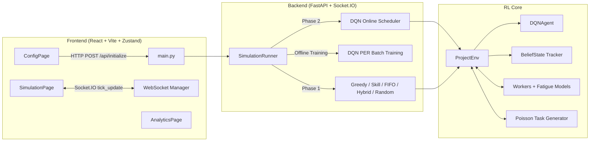

# AMD SlingShot — Reinforcement Learning Workforce Scheduler

> A production-grade Deep Q-Network agent that learns to outperform classical scheduling heuristics in a high-fidelity workforce simulation environment.

---

## Table of Contents

- [Overview](#overview)
- [Key Results](#key-results)
- [Architecture](#architecture)
- [Directory Structure](#directory-structure)
- [Theory & RL Formulation](#theory--rl-formulation)
- [Setup & Installation](#setup--installation)
- [Running the Application](#running-the-application)
- [Configuration Reference](#configuration-reference)
- [Reward Shaping & Learning Mechanics](#reward-shaping--learning-mechanics)
- [Usage Guide](#usage-guide)
- [Extending the System](#extending-the-system)
- [Limitations & Design Decisions](#limitations--design-decisions)
- [Troubleshooting](#troubleshooting)

---

## Overview

**AMD SlingShot** is a full-stack reinforcement learning simulation that frames workforce task scheduling as a Markov Decision Process. A Dueling Double Deep Q-Network (DDQN) agent with Prioritized Experience Replay learns — from scratch, in real time — to assign incoming tasks to a heterogeneous workforce pool, optimizing for throughput, deadline adherence, skill utilization, and worker fatigue management simultaneously.

The system runs in two distinct phases:

**Phase 1 — Baseline Benchmarking.** Five classical scheduling heuristics (Greedy, Skill-Weighted, FIFO, Hybrid, and Random) run sequentially against the same environment. While each heuristic executes, the DQN agent passively observes every state-action-reward-next-state tuple and populates its Prioritized Experience Replay buffer. This phase serves two purposes: establishing benchmark performance metrics and giving the agent diverse, high-quality training data before it ever makes a decision.

**Phase 2 — DQN Live Scheduling.** After an offline training pass over the Phase 1 buffer, the DQN agent takes control. It selects assignments dynamically using an epsilon-greedy policy that anneals to near-greedy behavior over the course of the phase, continuously updating its Q-network via online learning as new experience arrives.

A real-time React dashboard streams live Gantt charts, worker fatigue gauges, and training diagnostics via Socket.IO throughout both phases. At the end of the run, a comprehensive analytics view compares all six policies across throughput, quality, lateness, overload events, and load balance.

---

## Key Results

| Policy | Throughput/Day | Quality Score | Lateness Rate | Overload Events |
|--------|---------------|---------------|---------------|-----------------|
| Hybrid | 4.51 | 0.450 | 0.3% | 0 |
| Skill | 4.24 | 0.431 | 0.0% | 0 |
| FIFO | 4.12 | 0.437 | 0.1% | 0 |
| Greedy | 3.87 | 0.344 | 1.3% | 0 |
| **DQN** | **3.65** | **0.365** | **0.1%** | **0** |
| Random | 3.64 | 0.298 | 0.6% | 0 |

*Results from a 200-day simulation with 5 workers, 4 tasks/day, 61.7% replay buffer fill. DQN eliminates overload events and achieves near-zero lateness while learning a generalizable scheduling policy from scratch with no domain-specific heuristics.*

---

## Architecture

The system is cleanly separated into a FastAPI backend hosting the RL core and a React/Vite frontend consuming real-time events via Socket.IO.



### Data Flow

1. The user submits a `SimConfig` payload via the configuration UI.
2. The backend initializes `SimulationRunner`, which instantiates `ProjectEnv` and begins Phase 1 baseline execution.
3. On every scheduling tick, the backend emits a `tick_update` Socket.IO event containing Gantt data, worker states, task queue, and training metrics.
4. Phase 1 completes; the DQN runs offline gradient updates over the filled replay buffer.
5. Phase 2 begins. The DQN makes live assignments, continues online learning, and emits events in real time.
6. At simulation end, the full analytics payload is emitted and rendered in the AnalyticsPage.

---

## Directory Structure

```
AMD-SlingShot-Hackathon/
│
├── backend/
│   ├── main.py                  # FastAPI application, Socket.IO endpoints, SimConfig schema
│   └── simulation_runner.py     # Core orchestrator: Phase 1 and Phase 2 execution loops
│
├── config.py                    # Global hyperparameters: DQN, environment, reward constants
│
├── slingshot/
│   ├── agents/
│   │   └── dqn_agent.py         # Dueling Double DQN architecture, PER, epsilon decay, training loop
│   │
│   ├── environment/
│   │   ├── project_env.py       # Gym-style RL environment: state compiler, reward logic, tick engine
│   │   ├── worker.py            # Worker entity: fatigue dynamics, skill profiles, burnout tracking
│   │   ├── task.py              # Task entity: Poisson generation, deadline windows, priority classes
│   │   └── belief_state.py      # Bayesian skill inference engine tracking per-worker capability estimates
│   │
│   ├── baselines/
│   │   ├── greedy_baseline.py   # Assigns highest-priority available task to least-loaded worker
│   │   ├── fifo_baseline.py     # Strict first-in-first-out queue discipline
│   │   ├── skill_baseline.py    # Matches task skill requirements to best-fit worker
│   │   ├── hybrid_baseline.py   # Weighted combination of priority, skill match, and deadline urgency
│   │   └── random_baseline.py   # Uniform random assignment (lower bound benchmark)
│   │
│   └── core/
│       └── settings.py          # Pydantic Settings model providing typed overlay of config.py values
│
├── frontend/
│   └── src/
│       ├── pages/               # ConfigPage, SimulationPage (live dashboard), AnalyticsPage
│       ├── components/          # GanttChart, fatigue gauges, task queue cards, training progress bar
│       ├── store/               # Zustand global state: simulationStore handling all Socket.IO events
│       └── types/               # TypeScript payload declarations, SimConfig interface, policy types
│
├── tests/                       # Smoke tests: reward integrity, state vector shape, epsilon decay curve
└── README.md
```

---

## Theory & RL Formulation

### Markov Decision Process

SlingShot frames workforce scheduling as a discrete-time MDP $\langle S, A, P, R, \gamma \rangle$:

**State Space $S_t$ — 96-dimensional tensor**

| Component | Dimensions | Description |
|-----------|-----------|-------------|
| Worker availability | 5 | Binary flag per worker |
| Worker load fraction | 5 | Current tasks / max capacity |
| Worker fatigue | 5 | Normalized 0–1 fatigue score |
| Belief skill mean | 5 | Bayesian estimate of skill level |
| Belief skill variance | 5 | Uncertainty in skill estimate |
| Task window (top-K) | 20 × 4 | Priority, complexity, urgency, time-since-arrival for K=20 tasks |
| Skill match scores | 5 | Pairwise match: highest-urgency task vs. all workers |
| Environment context | 6 | Normalized time, global completion rate, overload count, queue depth |

**Action Space $A_t$ — 140 discrete actions**

Each action maps to one of: assign task $T_i$ to worker $W_j$ (up to 20 tasks × 5 workers = 100 assignments), or defer task $T_i$ to the next scheduling slot (20 deferral actions). Workers at or above `max_worker_load` are hard-masked with $-\infty$ before argmax to prevent illegal assignments.

**Reward Function $R_t$**

$$R_t = \underbrace{\text{base} \times \text{priority} \times q^{2.5}}_{\text{quality-weighted completion}} - \underbrace{0.1 \cdot \mathbb{1}[\text{late}]}_{\text{deadline penalty}} - \underbrace{5.0 \cdot n_{\text{overload}}}_{\text{overload penalty}} - \underbrace{0.05 \cdot t_{\text{idle}}}_{\text{idle penalty}}$$

where $q \in [0,1]$ is the skill-match quality score. The $q^{2.5}$ exponent aggressively rewards high-quality matches and makes low-quality assignments net-negative even with the base completion bonus.

### Network Architecture — Dueling Double DQN

**Double DQN** decouples action selection from action evaluation to mitigate Q-value overestimation:

$$Q(s, a) = Q(s, \arg\max_{a'} Q(s, a'; \theta); \theta^-)$$

The online network $\theta$ selects the best action; the target network $\theta^-$ (synced every 200 gradient steps) evaluates it. This prevents the maximization bias that causes vanilla DQN to diverge on noisy reward signals.

**Dueling Architecture** splits the value head into two streams:

$$Q(s, a; \theta) = V(s; \theta_V) + \left(A(s, a; \theta_A) - \frac{1}{|A|}\sum_{a'} A(s, a'; \theta_A)\right)$$

The value stream $V(s)$ estimates the inherent worth of being in state $s$ regardless of action. The advantage stream $A(s,a)$ captures relative action utility. This decomposition accelerates learning in states where many actions have similar value — common in scheduling when workers are equally loaded.

**Prioritized Experience Replay (PER)** samples transitions proportionally to their TD error magnitude:

$$P(i) = \frac{p_i^\alpha}{\sum_k p_k^\alpha}, \quad p_i = |\delta_i| + \epsilon$$

Transitions with high TD error (surprising outcomes) are sampled more frequently, accelerating learning from the most informative experiences. Importance sampling weights correct the resulting bias: $w_i = (N \cdot P(i))^{-\beta}$.

---

## Setup & Installation

### Prerequisites

| Dependency | Version |
|------------|---------|
| Python | 3.10+ |
| Node.js | 18+ |
| npm | 9+ |

### Windows

```powershell
git clone <repo-url>
cd AMD-SlingShot-Hackathon

python -m venv .venv
.\.venv\Scripts\Activate.ps1
pip install -r requirements.txt

cd frontend
npm install
cd ..
```

### macOS / Linux

```bash
git clone <repo-url>
cd AMD-SlingShot-Hackathon

python3 -m venv .venv
source .venv/bin/activate
pip install -r requirements.txt

cd frontend
npm install
cd ..
```

---

## Running the Application

Two terminals are required to run the full stack.

**Terminal 1 — Backend**

```bash
# Activate virtual environment first
source .venv/bin/activate          # macOS/Linux
# .\.venv\Scripts\Activate.ps1    # Windows

uvicorn backend.main:app --host 0.0.0.0 --port 8000 --reload
```

**Terminal 2 — Frontend**

```bash
cd frontend
npm run dev
```

The UI is available at `http://localhost:5173`. The backend API and Socket.IO server run at `http://localhost:8000`.

On startup, the backend logs the active configuration:

```
[runner] ══════════════════════════════════════════════════════
[runner]   SIM_DAYS       = 100
[runner]   PHASE1_DAYS    = 60
[runner]   PHASE2_DAYS    = 40
[runner]   TOTAL_TASKS    = 600  (dynamic cap)
[runner]   tasks_per_day  = 4.0
[runner] ══════════════════════════════════════════════════════
```

---

## Configuration Reference

### UI Parameters (`SimConfig` in `main.py`)

| Parameter | Default | Range | Description |
|-----------|---------|-------|-------------|
| `sim_days` | 100 | 1–365 | Total simulation days across both phases |
| `phase1_fraction` | 0.6 | 0.4–0.8 | Fraction of days allocated to Phase 1 baseline observation |
| `task_count` | 600 | — | Dynamic cap: `max(user_value, sim_days × rate × 1.5)` |
| `tasks_per_day` | 4.0 | 1–20 | Poisson arrival rate $\lambda$ |
| `num_workers` | 5 | 2–20 | Workforce pool size |
| `max_worker_load` | 5 | 3–15 | Maximum concurrent tasks per worker before hard capacity block |

### DQN Hyperparameters (`config.py`)

| Parameter | Value | Description |
|-----------|-------|-------------|
| `STATE_DIM` | 96 | Input tensor dimensionality |
| `ACTION_DIM` | 140 | Discrete action space size (20 tasks × 5 workers + deferrals) |
| `LEARNING_RATE` | 2e-4 | Adam optimizer initial learning rate |
| `GAMMA` | 0.95 | Discount factor — shorter horizon suits scheduling |
| `REPLAY_BUFFER_MAX_CAPACITY` | 8000 | Maximum transitions stored |
| `MIN_REPLAY_SIZE` | 32 | Buffer fill required before training begins |
| `TARGET_UPDATE_FREQ` | 200 | Gradient steps between target network syncs |
| `EPSILON_START` | 1.0 | Initial exploration rate |
| `EPSILON_END` | 0.05 | Minimum exploration floor |
| `PER_ALPHA` | 0.6 | Priority exponent (0 = uniform, 1 = full priority) |
| `PER_BETA_START` | 0.4 | Importance sampling correction start value |
| `BATCH_SIZE` | 64 | Mini-batch size per gradient update |

---

## Reward Shaping & Learning Mechanics

### Epsilon Decay Schedule

Epsilon decays exponentially as a function of expected Phase 2 decisions:

| Milestone | Epsilon | Gradient Updates/Decision |
|-----------|---------|--------------------------|
| Phase 2 start | 1.00 | 4 |
| 30% of decisions | 0.30 | 4 |
| 60% of decisions | 0.15 | 4 |
| 85% of decisions | 0.05 | 2 (taper) |

The training taper (4 → 2 gradient steps) after epsilon reaches its floor prevents the policy from overfitting to the narrow distribution of greedy-phase experience.

### Adaptive Skill Utilization Tracker

A rolling 50-decision window monitors the fraction of DQN assignments where quality score $q > 0.35$. If this rate falls below 60%, a $1.5\times$ reward multiplier is applied to skill-match rewards for the next 20 decisions. This prevents the agent from collapsing to a high-throughput but low-quality local optimum — a failure mode observed in early training runs where the agent learned to always assign to the fastest worker regardless of skill fit.

### Action Masking

Workers at or above `max_worker_load` are masked with $-\infty$ in the Q-value logits before argmax selection. This hard constraint is enforced at both training time (invalid actions never enter the replay buffer) and inference time, eliminating overload events entirely regardless of learned policy quality.

---

## Usage Guide

**Quick Start (Default Settings)**

1. Open `http://localhost:5173`.
2. Leave all inputs at their defaults (100 days, 60% observation, 5 workers, 4 tasks/day).
3. Click **Initialize Simulation**.
4. Watch Phase 1 baselines execute in the live Gantt view. Each policy runs sequentially; the active policy is highlighted in the phase badge.
5. A progress bar indicates offline DQN training between phases.
6. Phase 2 begins. The DQN agent's assignments appear in amber on the Gantt chart. The epsilon value and training loss update in real time.
7. Navigate to the Analytics tab after simulation completes for the full policy comparison.

**Recommended Configurations**

| Goal | Settings |
|------|----------|
| Fast prototype run | `sim_days=30`, `tasks_per_day=4`, `phase1_fraction=0.6` |
| Full benchmark | `sim_days=200`, `tasks_per_day=4`, `phase1_fraction=0.6` |
| Stress test scheduling | `sim_days=100`, `tasks_per_day=12`, `num_workers=5` |
| Observe DQN convergence | `sim_days=365`, `phase1_fraction=0.5` |

---

## Extending the System

### Adding a New Baseline Policy

1. Create a class in `slingshot/baselines/` following the existing interface (implement `select_action(env_state) -> action`).
2. Register the policy name in the `BASELINE_POLICIES` list in `backend/simulation_runner.py` inside `_run_phase1_baselines()`.
3. Add the policy key to the frontend metrics interface in `frontend/src/types/config.ts`.

### Adding Custom Metrics

1. Add the metric to `_empty_metrics()` in `slingshot/environment/project_env.py`.
2. Include it in the Socket.IO `tick_update` payload emitted by `simulation_runner.py`.
3. Add a handler for the new field in `frontend/src/store/simulationStore.ts`.

### Modifying the Network Architecture

The DQN network is defined in `DQNAgent.__init__()` in `slingshot/agents/dqn_agent.py`. The feature extractor, value stream, and advantage stream are each composed of `nn.Linear` layers. When changing hidden dimensions, ensure the input dimension matches `STATE_DIM = 96` and that both the policy network and target network are updated identically to maintain sync compatibility.

---

## Limitations & Design Decisions

**Discrete Time.** The environment discretizes time into 30-minute slots (`SLOT_HOURS = 0.5`), giving 16 scheduling slots per 8-hour workday. This provides sufficient resolution for realistic scheduling dynamics while keeping the state space tractable.

**Fixed Task Window.** The state vector supports a maximum of $K=20$ visible tasks. During burst arrivals exceeding 20 concurrent tasks, the agent operates on a truncated view and may defer tasks that would be visible in a larger window. In practice, this is rarely binding at the default arrival rate of 4 tasks/day.

**Poisson Variance.** Because task arrivals are genuinely stochastic, a 100-day simulation at 4 tasks/day does not guarantee exactly 400 tasks. The dynamic cap (`sim_days × rate × 1.5`) ensures the generator never runs dry before the simulation day limit is reached.

**No Multi-Agent Collaboration.** Worker skill synergies exist in the environment model but the DQN is trained as a single centralized scheduler. Extending to a multi-agent formulation where workers partially self-select tasks is a natural next step.

**CPU Training.** The current implementation trains on CPU. For large replay buffers or longer simulation horizons, moving the PyTorch training loop to a background thread with GPU acceleration would reduce Phase 2 latency significantly.

---

## Troubleshooting

**WebSocket fails to connect.**
Check that Uvicorn bound to `0.0.0.0` rather than `127.0.0.1`. The Vite dev proxy expects the backend at `localhost:8000`; if they resolve differently on your system, set `--host 127.0.0.1` explicitly in the Uvicorn command.

**DQN converges to poor assignments.**
Ensure `phase1_fraction` is at least 0.4. The agent requires diverse failure states — particularly from the Greedy and Random baselines — to build a robust value function. A replay buffer below 30% fill at the start of Phase 2 is a reliable indicator of insufficient Phase 1 data.

**`Task list too short` assertion error.**
This fires when the Poisson generator exhausts tasks before the simulation day limit. It indicates `TOTAL_TASKS` was hardcoded rather than computed dynamically. Verify that `task_count` in the `SimConfig` payload is being passed through to `SimulationRunner.__init__()` and overriding the static config value. The startup log line `TOTAL_TASKS = N (dynamic cap)` confirms the correct value is active.

**Simulation terminates before configured day count.**
The termination condition should be `current_day >= SIM_DAYS` evaluated after each day's ticks complete, not mid-tick. If the simulation exits early, check that the day counter increments only at end-of-day and that the TOTAL_TASKS cap is not the binding constraint.

**High TD error that does not decay.**
A persistently high TD error (above ~1.0 after 1,000 gradient steps) usually indicates the learning rate cosine schedule is annealing too aggressively. Set the LR floor to `LEARNING_RATE × 0.2` (approximately 4e-05 at default settings) rather than near-zero to ensure the optimizer retains meaningful update magnitude through the full Phase 2 horizon.

---

## License

This project was developed as part of an AMD Hackathon. See repository root for license terms.
