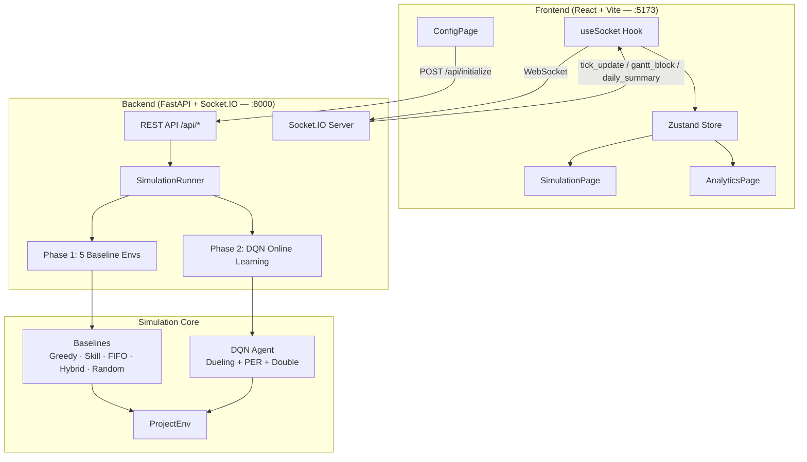

# DQN Workforce Scheduler Dashboard

An industrial-grade, locally hosted web dashboard that interfaces with a **Continual Online Deep Q-Network (DQN) Workforce Scheduling System**. It runs a two-phase simulation — Phase 1 benchmarks 5 baseline schedulers, Phase 2 puts the DQN agent in control — streaming all data to the dashboard in real time via WebSockets.

---

## System Architecture



---

## Directory Structure

```
AMD-SlingShot-Hackathon/
├── package.json              # Root: unified npm run dev command
├── requirements.txt          # Python backend dependencies
├── config.py                 # Global hyperparameters & environment settings
├── continual_scheduler.py    # Continual scheduling orchestration
├── run_pipeline.py           # Full offline training pipeline
│
├── backend/                  # FastAPI + Socket.IO server
│   ├── main.py               # ASGI app, REST endpoints, Socket.IO events
│   ├── simulation_runner.py  # Two-phase async simulation orchestrator
│   └── readme_generator.py   # Auto README generation via WebSocket
│
├── agents/
│   └── dqn_agent.py          # Dueling DQN + Double DQN + PER + Cosine LR
│
├── baselines/
│   ├── greedy_baseline.py    # Greedy least-loaded assignment
│   ├── skill_baseline.py     # Skill-matched assignment with Bayesian belief
│   ├── stf_baseline.py       # Shortest-Task-First (displayed as "FIFO")
│   ├── hybrid_baseline.py    # Hybrid urgency + skill policy
│   └── random_baseline.py   # Random assignment (sanity baseline)
│
├── environment/
│   └── project_env.py        # OpenAI-Gym-compatible scheduling environment
│
├── frontend/                 # React + Vite TypeScript dashboard
│   ├── src/
│   │   ├── pages/            # ConfigPage, SimulationPage, AnalyticsPage
│   │   ├── components/       # GanttChart, WorkerSidebar, TaskQueue, ComparisonStrip
│   │   ├── hooks/            # useSocket.ts, useSimulation.ts
│   │   ├── store/            # simulationStore.ts (Zustand)
│   │   └── types/            # simulation.ts, config.ts, metrics.ts
│   ├── index.html
│   ├── package.json
│   └── vite.config.ts
│
├── results/                  # Auto-generated CSV metrics
├── checkpoints/              # Saved DQN model checkpoints
└── logs/                     # Training and simulation logs
```

---

## Environment Setup

### 1. Python (Backend)

```bash
# From project root
python -m venv .venv

# Windows:
.venv\Scripts\activate

# macOS/Linux:
source .venv/bin/activate

pip install -r requirements.txt
```

### 2. Node.js (Frontend + Unified Startup)

```bash
# Install root concurrently package
npm install

# Install frontend dependencies
cd frontend && npm install && cd ..
```

---

## Running the Application

### Single Command (Recommended)

```bash
npm run dev
```

This uses `concurrently` to start both servers simultaneously:
- **Backend**: `uvicorn backend.main:app --host 0.0.0.0 --port 8000 --reload`
- **Frontend**: Vite dev server at `http://localhost:5173`

Open your browser at: **http://localhost:5173**

### Manual (Two Terminals)

Terminal 1 — Backend:
```bash
.venv\Scripts\python -m uvicorn backend.main:app --host 0.0.0.0 --port 8000 --reload
```

Terminal 2 — Frontend:
```bash
cd frontend && npm run dev
```

---

## Configuration Guide

Access the **Control Panel** at `http://localhost:5173`. Configure:

| Field | Description | Default |
|-------|-------------|---------|
| Phase 1 Days | Baseline observation period | 20 days (1 month) |
| Phase 2 Days | DQN-controlled scheduling | 5 days (1 week) |
| Workers | Count (1–25) or manual config per-worker | 5 auto |
| Worker Seed | Random seed for reproducible worker generation | 42 |
| Arrival Distribution | poisson / uniform / burst / custom | poisson |
| Task Count | Total tasks across simulation | 200 |
| Random Seed | Global reproducibility seed | 42 |

---

## Module Architecture

### Simulation Environment (`environment/project_env.py`)
OpenAI Gym-compatible environment with:
- 8h workday (16 × 30min slots), Mon–Fri schedule
- Heterogeneous workers: per-worker skill, fatigue rate, recovery rate, burnout resilience
- Dynamic Poisson task arrivals (no lookahead)
- State vector: 96-dimensional (5 workers × 5 + 10 visible tasks × 5 + beliefs + global)
- Action space: 140 actions (20 tasks × 5 workers + 20 defer + 20 escalate)

### Baseline Schedulers (`baselines/`)
All run simultaneously on independent environment copies in Phase 1:

| Name | Strategy |
|------|----------|
| **Greedy** | Least-loaded worker, highest-priority task first |
| **Skill** | Bayesian skill estimation, match task requirements |
| **FIFO** | Shortest task first to maximize throughput |
| **Hybrid** | Urgency + skill combined heuristic |
| **Random** | Uniform random valid action (sanity check) |

### DQN Agent (`agents/dqn_agent.py`)
- **Architecture**: Dueling DQN (Value + Advantage streams)
- **Training**: Double DQN with Prioritized Experience Replay (PER)
- **LR Schedule**: Cosine Annealing with Warm Restarts
- **Phase 1**: Passive observation — stores transitions, does not control
- **Phase 2**: Full online learning, per-decision epsilon decay

### Backend API (`backend/main.py`)

| Method | Endpoint | Description |
|--------|----------|-------------|
| `POST` | `/api/initialize` | Start simulation with config |
| `POST` | `/api/pause` | Pause running simulation |
| `POST` | `/api/resume` | Resume paused simulation |
| `GET`  | `/api/status` | Current simulation state |
| `GET`  | `/api/export` | Download metrics CSV |
| `POST` | `/api/generate-readme` | Auto-generate all READMEs |

### Frontend Dashboard (`frontend/src/`)

| Page | Route | Description |
|------|-------|-------------|
| `ConfigPage` | `/` | Simulation configuration wizard |
| `SimulationPage` | `/simulation` | Live real-time view with Gantt charts |
| `AnalyticsPage` | `/analytics` | Post-run analytics & comparison |

### WebSocket Events (Backend → Frontend)

| Event | Payload | Description |
|-------|---------|-------------|
| `tick_update` | tick, day, phase, workers, queue | Live state every N decisions |
| `gantt_block` | task_id, worker_id, start/end_tick, urgency, policy | One assignment block |
| `daily_summary` | day, phase, metrics_per_policy | End-of-day metrics for all policies |
| `phase_transition` | new_phase, baseline_results_snapshot | Phase 1 complete |
| `simulation_complete` | final_metrics | Full results |

---

## Technology Stack

| Layer | Technology |
|-------|------------|
| Frontend framework | React 19 + TypeScript + Vite 7 |
| Styling | Tailwind CSS v4 + custom CSS tokens |
| Charts | Recharts (bar, radar, line) + custom SVG Gantt |
| State management | Zustand |
| WebSocket client | socket.io-client v4 |
| Routing | React Router v6 |
| Backend framework | FastAPI + python-socketio (AsyncServer) |
| ML framework | PyTorch |
| Async runtime | asyncio + uvicorn |