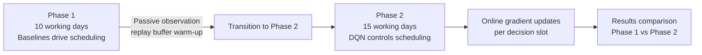

# Online Learning Architecture & Design

## System Overview

This repository implements a **Continual Online Learning Scheduler** using a two-phase adaptive DQN framework for heterogeneous multi-worker task scheduling.

### Key Principles
1. **Zero Lookahead** — No agent (DQN or baseline) ever sees future tasks. Tasks arrive via a Poisson process; only tasks with `arrival_tick ≤ current_tick` are schedulable.
2. **Workday Fidelity** — Time is measured in 30-minute slots within an 8h/day, 5-day/week calendar. Workers reset intra-day fatigue every morning.
3. **Continual Learning** — DQN learns *during* scheduling, not *before*. No train-then-freeze pipeline.

---

## Two-Phase Adaptive Framework



### Phase 1 (2 weeks = 10 working days)
- Baseline pool rotates: **Greedy → Hybrid → Skill**
- DQN *passively collects* `(s, a, r, s', done)` transitions into the PER replay buffer
- No gradient updates — this is a warm-up phase
- Skill baseline runs `observe_episode()` at each day boundary to refine skill estimates

### Phase 2 (3 weeks = 15 working days)
- DQN takes full control; epsilon starts at `EPSILON_PHASE2_START=0.40`
- `online_step()` is called every scheduling decision:
  1. ε-greedy action selection (with action masking)
  2. Execute in environment
  3. Store transition to PER buffer
  4. Run `train_step()` (Double DQN + PER importance weighting)
  5. Decay ε
- Target network synced every `TARGET_UPDATE_FREQ=150` decisions
- Checkpointed at best daily throughput

---

## State Space (96-dim)

| Component | Dims | Description |
|-----------|------|-------------|
| Worker features | 5 × 5 = 25 | load_norm, fatigue_norm, availability, hours_worked_norm, productivity |
| Task features | 10 × 5 = 50 | priority, complexity, deadline_urgency, deps_met, arrival_elapsed |
| Belief state | 10 | 5 skill means + 5 skill variances (Bayesian Beta posteriors) |
| Global context | 6 | time_progress, completion_rate, failure_rate, idle_norm, n_available_norm, day_progress |
| Padding | 5 | zeros |

---

## Action Space (140 actions)

| Range | Type | Description |
|-------|------|-------------|
| 0–99 | assign | task_slot (0–19) × 5 workers → max 20 tasks × 5 workers = 100 |
| 100–119 | defer | defer task at slot 0–19 |
| 120–139 | escalate | escalate task at slot 0–19 |

All agents use `get_valid_actions()` which only returns actions for **currently arrived tasks** — zero lookahead guaranteed.

---

## Reward Function (Makespan-Centric)

```
R_t = completion_reward     +COMPLETION_BASE × (priority+1) × quality per task done
    + idle_penalty          −IDLE_PENALTY × n_idle_available_workers per slot
    + lateness_penalty      −LATENESS_PENALTY × slots_late (at task completion)
    + urgency_penalty       −URGENCY_PENALTY × n_urgent_unstarted
    + overload_penalty      −std(worker_loads) × OVERLOAD_WEIGHT
    + deadline_miss         −DEADLINE_MISS_PENALTY × n_newly_failed
    + makespan_bonus        +100 × (1 − time_used/total_slots) [terminal, one-shot]
    + constant              DELAY_WEIGHT  (−0.05 per step)
```

---

## Worker Heterogeneity (Hidden Parameters)

Each worker has permanent hidden traits (never in state vector):

| Param | Range | Effect |
|-------|-------|--------|
| `true_skill` | [0.5, 1.5] | Quality and completion speed |
| `speed_multiplier` | [0.6, 1.5] | Processing speed scaling |
| `fatigue_rate` | [0.05, 0.5] | How fast they tire under overload |
| `recovery_rate` | [0.02, 0.25] | How fast they recover when idle |
| `fatigue_sensitivity` | [0.05, 0.35] | How much fatigue slows them down |
| `burnout_resilience` | [1.8, 3.2] | Fatigue threshold before burnout |

---

## DQN Architecture (Preserved from v3)

- **Dueling DQN**: Separate value/advantage streams → Q(s,a) = V(s) + A(s,a) − mean(A)
- **Double DQN**: Policy net selects action; target net evaluates it (reduces overestimation)
- **Prioritized Experience Replay (PER)**: Samples high TD-error transitions more frequently
- **Cosine LR Scheduler**: Warm restarts every 2000 gradient steps

---

## Skill Baseline Fixes (v4)

| Issue | Fix |
|-------|-----|
| List accumulation bias | Welford incremental mean (single float per worker) |
| Non-deterministic selection | Explicit `max()` loop with tie-breaking by worker_id |
| Missing verification | `assert best_worker.worker_id == argmax(skill_scores)` |
| No debug visibility | `config.BASELINE_DEBUG_SKILL=True` logs every assignment |
| Stale API (`env.current_timestep`) | Updated to `env.clock.tick` |
